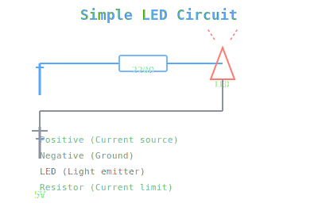

Before diving into microcontrollers, it's good to understand basic circuits. Let me walk through building a simple LED circuit - something you can prototype in minutes.

## The circuit

Here's what we're building:

Pretty simple: battery → resistor → LED → back to battery. The resistor limits current to protect the LED.

## What you need

- 1x LED (any color)
- 1x Resistor (220Ω is safe for most LEDs with a 5V source)
- 1x Battery (5V USB power, 9V battery, whatever)
- Breadboard and jumper wires

## Why the resistor?

An LED will burn out instantly without a current-limiting resistor. Here's why:

LEDs have a forward voltage drop (typically 2V for red, 3.3V for blue). If you hook it directly to 5V without a resistor:

- The LED sees 5V - 2V = 3V across itself
- With no resistance, current = V/R = 3V/0Ω = ∞ (basically)
- LED gets fried in milliseconds

The resistor limits current to a safe level (~20mA).

## Calculating resistor value

Use Ohm's law: **R = V / I**

For a 5V source with a red LED:
- Available voltage after LED drop: 5V - 2V = 3V
- Desired current: 20mA = 0.02A
- Required resistance: 3V / 0.02A = **150Ω**

Standard resistor values: 150Ω, 220Ω, 330Ω all work. Higher resistance = dimmer LED but safer.

## Building it

1. Insert the LED's **long leg (anode)** into the positive rail
2. Insert a resistor into the same row as the LED's short leg
3. Connect the resistor to the negative rail
4. Power it up

The LED lights up immediately. No code, no complexity - just physics.

## Next steps

- Experiment with different resistor values and see the brightness change
- Try different LED colors (they have different forward voltages)
- Build on a real breadboard instead of a simulator
- Add a button to control the LED

This is the foundation. Once you understand how current flows and voltage drops, microcontroller circuits become way less mysterious.
